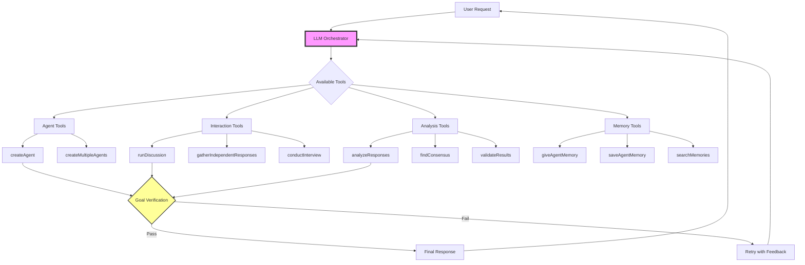
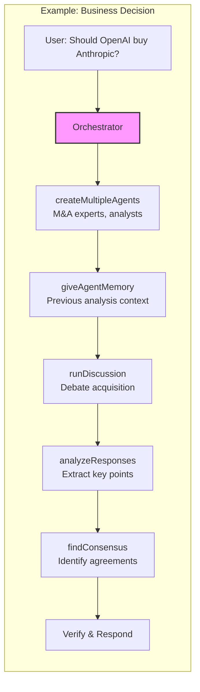
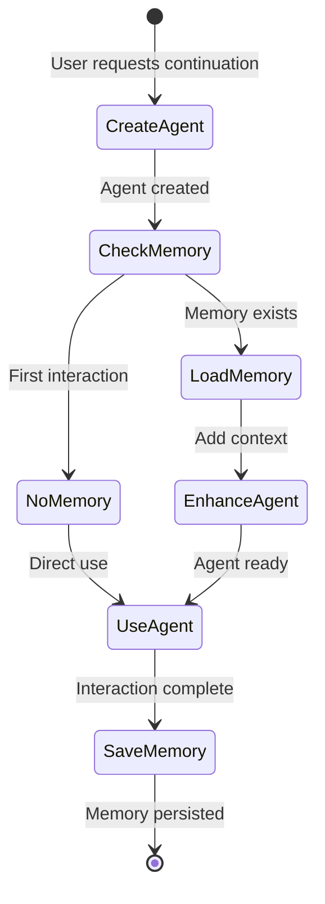
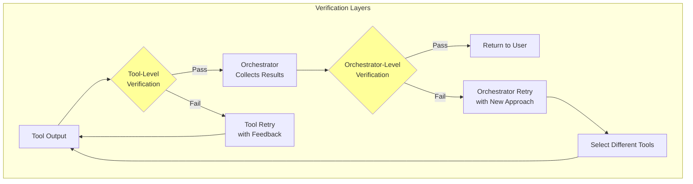
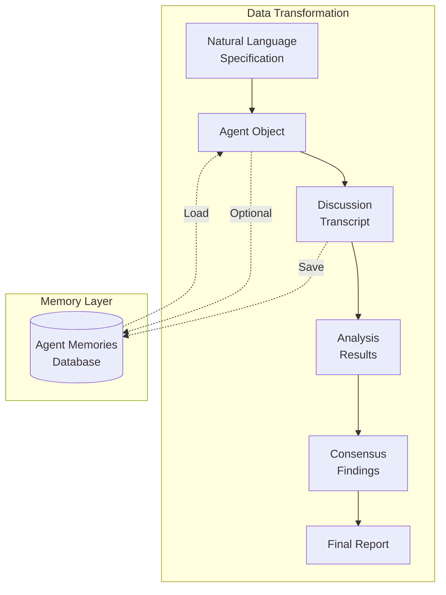
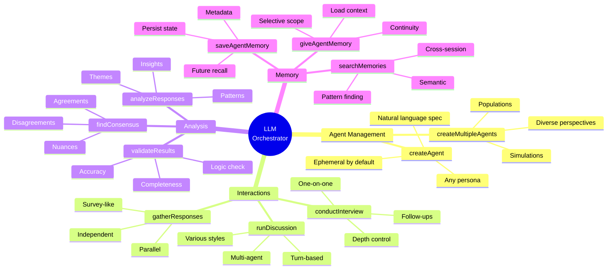
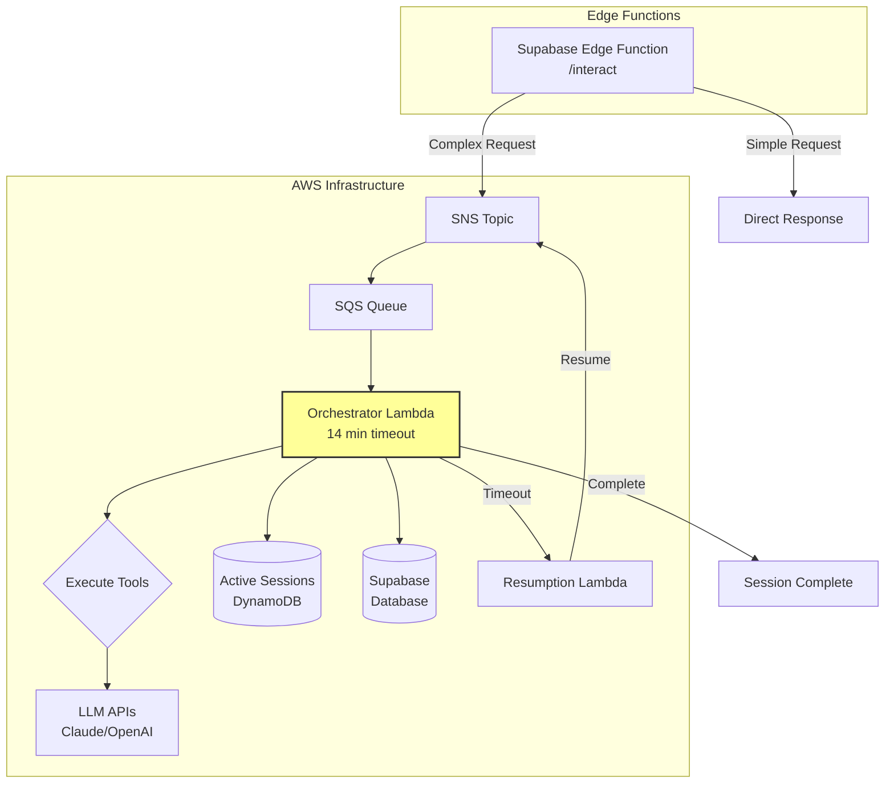
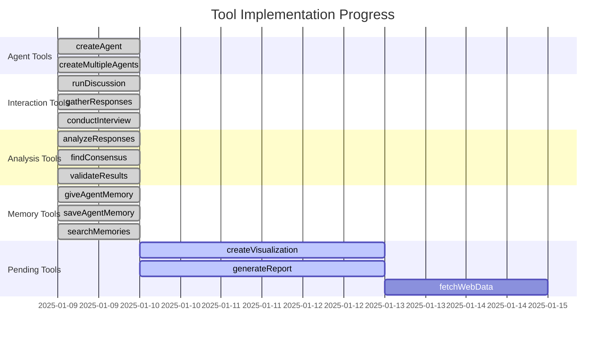

# Tool System Architecture Diagram

## Overview
This diagram shows how the LLM orchestrator uses tools to accomplish user goals.

## Tool Composition Flow

## Memory Tool Flow

## Verification System

## Data Flow Through Tools

## Tool Categories and Capabilities

## AWS Lambda Architecture

## Implementation Status

