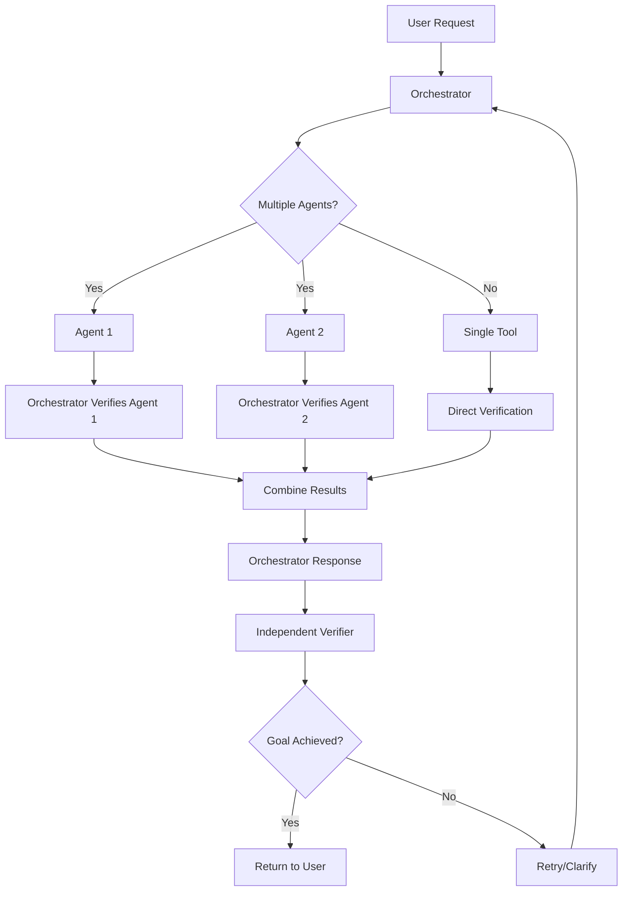

# Goal Verification Architecture

## Overview
Every LLM interaction in Hawking Edison must be verified to ensure it accomplished the user's intended goal. This creates a trust layer that prevents hallucinations, incorrect outputs, or misunderstood requests from affecting the user experience.

## Architecture Layers

### 1. Agent-Level Verification
- **What**: Each agent's output is verified by the orchestrator
- **How**: Orchestrator compares agent output against original request
- **Example**: User asks for "security analysis" → Agent provides analysis → Orchestrator verifies it actually contains security insights

### 2. Orchestrator-Level Verification
- **What**: The orchestrator's final response is verified by a separate verification session
- **How**: Independent LLM call with different system prompt focused on verification
- **Example**: Orchestrator claims task complete → Verifier checks if user's goal was actually achieved

### 3. Moderator Verification
- **What**: When agents discuss/debate, moderator conclusions are verified
- **How**: Orchestrator reviews moderator's synthesis against discussion content
- **Example**: Moderator summarizes debate → Orchestrator ensures key points weren't missed

## Implementation Pattern

```typescript
// Verification result structure
interface VerificationResult {
  goalAchieved: boolean
  confidence: number // 0-1
  issues?: string[]
  suggestions?: string[]
}

// Every tool execution includes verification
async function executeWithVerification(tool: Tool, input: any, goal: string) {
  const result = await tool.execute(input)
  const verification = await verifyResult(result, goal)
  
  if (!verification.goalAchieved) {
    // Retry with clarification or different approach
    return retryWithFeedback(tool, input, verification)
  }
  
  return { result, verification }
}
```

## Verification Prompts

### Agent Verification Prompt
```
You are a verification system. Your job is to determine if an agent's output successfully addresses the user's goal.

User's Goal: {goal}
Agent's Output: {output}

Analyze:
1. Does the output directly address the goal?
2. Is the output complete and accurate?
3. Are there any obvious errors or omissions?

Respond with:
- goalAchieved: true/false
- confidence: 0-1
- issues: [list of problems if any]
- suggestions: [how to improve if needed]
```

### Orchestrator Verification Prompt
```
You are an independent verification system checking if the orchestrator successfully completed the user's request.

Original Request: {userInput}
Orchestrator's Actions: {toolCalls}
Final Response: {response}

Verify:
1. Was the user's actual intent understood correctly?
2. Were the right tools used in the right way?
3. Does the response fully satisfy the request?
4. Are there any signs of hallucination or error?

Be skeptical but fair. Users depend on this verification.
```

## Verification Flow



## Key Principles

1. **Independence**: Verifiers use different prompts/contexts than executors
2. **Transparency**: Verification results included in response metadata
3. **Iterative**: Failed verifications trigger retries with feedback
4. **Confidence Scoring**: Not binary - includes confidence levels
5. **User Control**: Users can request re-verification or override

## Database Schema Addition

```sql
-- Add to interactions table
ALTER TABLE interactions ADD COLUMN verification_results JSONB DEFAULT '[]'::jsonb;

-- Verification logs for analysis
CREATE TABLE verification_logs (
  id UUID PRIMARY KEY DEFAULT uuid_generate_v4(),
  interaction_id UUID REFERENCES interactions(id),
  verification_type TEXT NOT NULL, -- 'agent', 'orchestrator', 'moderator'
  target_id TEXT NOT NULL, -- agent name or tool call id
  goal TEXT NOT NULL,
  result JSONB NOT NULL, -- VerificationResult
  created_at TIMESTAMPTZ DEFAULT NOW()
);

CREATE INDEX idx_verification_logs_interaction ON verification_logs(interaction_id);
CREATE INDEX idx_verification_logs_type ON verification_logs(verification_type);
```

## Metrics to Track

1. **Verification Success Rate**: % of first attempts that pass verification
2. **Retry Count**: Average retries needed per request
3. **Confidence Distribution**: Histogram of confidence scores
4. **Common Failure Patterns**: Most frequent verification issues
5. **User Overrides**: How often users disagree with verification

## Future Enhancements

1. **Learning System**: Use verification results to improve future performance
2. **User Preferences**: Some users may want stricter/looser verification
3. **Domain-Specific Verifiers**: Specialized verification for code, analysis, etc.
4. **Verification Explanations**: Natural language explanation of verification decision
5. **Batch Verification**: Verify multiple related interactions together

## Example Implementation

```typescript
// In orchestrator
async function processUserRequest(input: string) {
  // ... normal orchestration ...
  
  // After getting response
  const verification = await verifyOrchestratorResponse(
    input,
    toolCalls,
    response
  )
  
  // Include in metadata
  return {
    ...response,
    metadata: {
      ...response.metadata,
      verification: {
        passed: verification.goalAchieved,
        confidence: verification.confidence,
        attempts: attemptCount
      }
    }
  }
}
```

This architecture ensures every LLM interaction is checked for goal achievement, creating a reliable and trustworthy system for users.